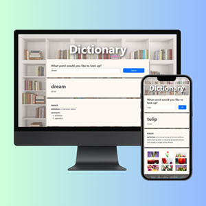

📖 Dictionary with Photos

Live Demo → https://dictionary-with-photos.netlify.app/

A single‑page React dictionary that pairs clear definitions with curated images. Type a term, hit Enter – you get clean definitions, phonetic transcription, and a grid of curated photos that lock the meaning in memory.

Why I built it

This project explores how combining text with imagery can improve vocabulary retention. Text alone doesn’t stay in memory; text + imagery does. So I built a clean React front‑end with two public APIs—one for words, one for pictures—and deployed it to Netlify.

Key Features

-  Fast lookup. Meaning, part of speech, synonyms, examples and IPA in one view.
-  Pronunciation hint. Inline IPA shows how to say the word.
-  Visual cue. Nine royalty‑free photos illustrate the word (via SheCodes Images API).
-  Optimised for mobile & desktop. Bootstrap grid + light CSS; quick load times.
-  Pure front‑end. Just React and HTTPS calls, no server needed.

Tech Stack

-  UI: React 18, React Hooks for state; Bootstrap 5 utility classes for spacing & grid
-  Data: SheCodes Dictionary API for lexical data; SheCodes Images API for photos
-  HTTP: Axios – tiny, promise‑based, simple error handling
-  Dev: Create React App scaffold, ESLint + Prettier for code quality
-  Deploy: Netlify CI/CD on every push to main

How it Works

1. On load, the app searches for a default word (dream).
2. Dictionary.js manages the input field and triggers an Axios request to /dictionary/v1/define.
3. Once the definition arrives, a second call pulls related images from /images/v1/search.
4. Child components (Result, Meaning, Photos) render the data in tidy sections.

What I learned

-  Handling multiple asynchronous calls in a single component with useState + useEffect.
-  Quick‑and‑clean deployment pipeline with Netlify.
